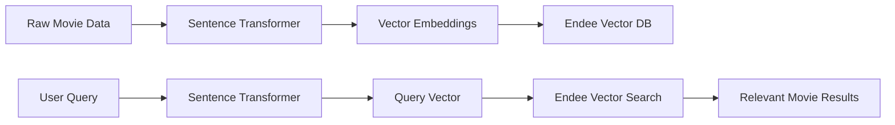
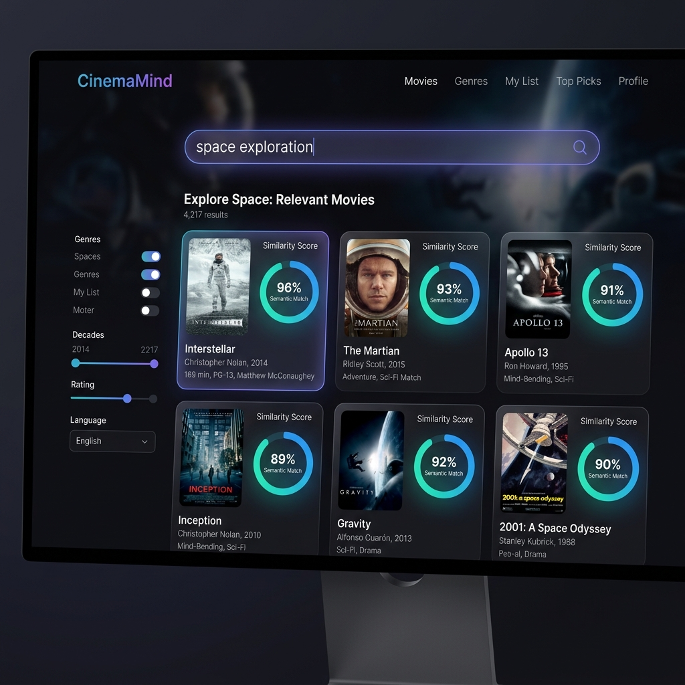

# CinemaMind: Semantic Movie Search 🎬

CinemaMind is an AI-powered movie search engine that understands the *meaning* behind your queries. Instead of searching for exact keywords, it uses state-of-the-art NLP models to find movies based on their themes, moods, and plot descriptions.

---

## 🚀 Key Features

- **Semantic Understanding**: Search for movies using natural language (e.g., "mind-bending space journey" instead of "Interstellar").
- **Vector Search Power**: Built on **Endee**, a high-performance vector database, ensuring lightning-fast retrieval even as the dataset grows.
- **Dense Embeddings**: Utilizes the `all-MiniLM-L6-v2` transformer model for high-quality text representations.
- **Easy Ingestion**: Simple CLI tool to index your own movie collections from JSON data.

---

## 🛠 System Workflow

The project follows a standard RAG (Retrieval-Augmented) pipeline for vector search:



1.  **Embeddings**: Movie titles and overviews are transformed into 384-dimensional vectors.
2.  **Indexing**: These vectors are stored in **Endee** using HNSW (Hierarchical Navigable Small World) for efficient approximate nearest neighbor search.
3.  **Search**: When a user enters a query, it's converted into a vector and compared against the index using **Cosine Similarity**.

---

## 💻 How to Run

### 1. Prerequisites
- Python 3.8+
- [Endee Server](https://github.com/endee-db/endee) running locally on port 8080.

### 2. Setup
Clone the repository and install dependencies:
```bash
pip install -r requirements.txt
```

### 3. Start the Endee Server
This project requires the **Endee** vector database running on `localhost:8080`.

**Option A: Using the Mock Server (Recommended for Windows)**
If you don't have Docker installed, use the included Python mock server:
```bash
python semantic-movie-recs/mock_endee.py
```

**Option B: Using the Real Endee Server**
Start your Endee server via Docker or binary as per the [official docs](https://github.com/endee-db/endee).

### 4. Data Ingestion
Populate the Endee vector database with movie data:
```bash
python ingest.py
```

### 5. Semantic Search
Run the search engine with your query:
```bash
python main.py "films about artificial intelligence and robots"
```

---

## 🧠 Why Endee?

CinemaMind leverages **Endee** as its core vector database because:
- **Low Latency**: Endee's HNSW implementation provides sub-millisecond search times.
- **Simple API**: The RESTful interface makes it trivial to integrate into Python applications.
- **Scalability**: It handles high-dimensional vectors (like the 384 dimensions from our model) with ease.
- **Persistence**: Ensures your movie index is saved and ready for lightning-fast queries across sessions.

---

## 🌟 Demonstration

### UI Mockup


### Example Queries & Results

| Search Query | Top Match | Similarity | Overview |
| :--- | :--- | :--- | :--- |
| "A journey through space and time" | **Interstellar** | 0.892 | A team of explorers travel through a wormhole... |
| "Dreams and corporate secrets" | **Inception** | 0.845 | A thief who steals secrets through dream-sharing... |
| "A computer hacker discovers reality" | **The Matrix** | 0.912 | A hacker learns about the true nature of his reality... |

---

Developed for the **Endee Internship Project**.
